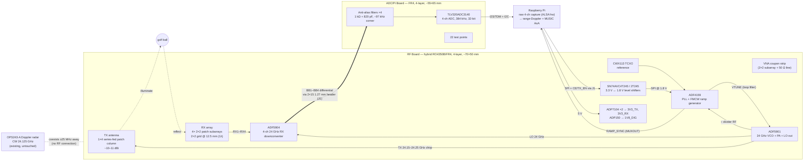

# Rev C Active FMCW Radar — Two-Board Block Diagram

System-level block diagram of the Rev C design (spec:
`docs/superpowers/specs/2026-07-01-adf590x-active-fmcw-rev-c-design.md`).
Renders on GitHub and in any Mermaid viewer.

Key relationships: the ADF5901's VCO output is simultaneously the TX chirp and
the ADF5904's LO (coherence by construction); the ADF4159 closes the PLL loop
and generates the FMCW ramps; the OPS243 has no electrical connection — it
coexists ≥25 MHz below the chirp band.

